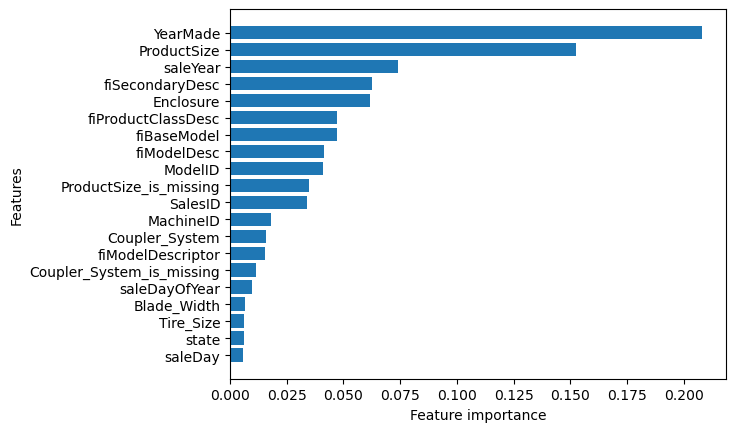

# Blue Book for Bulldozers

## Overview

This project is centered around the Kaggle competition **"Blue Book for Bulldozers."** The challenge is to predict the auction sale price for a piece of heavy equipment to create a "blue book" for bulldozers. The dataset used in this competition contains various factors such as usage, equipment type, and configuration that influence the auction sale prices.

Competition URL: [Kaggle Blue Book for Bulldozers](https://www.kaggle.com/c/bluebook-for-bulldozers/overview)

## Project Goals

- Predict the auction sale prices of heavy equipment.
- Understand and visualize feature importance.
- Improve model performance through various machine learning techniques.

## Model Results

- **Training MAE:** 2953.82
- **Validation MAE:** 5951.25
- **Training RMSLE:** 0.1447
- **Validation RMSLE:** 0.2452
- **Training R²:** 0.9588
- **Validation R²:** 0.8818

## Outputs

The outputs generated by the model are saved in the following files:

- **Predictions:** [test_predictions.csv](test_predictions.csv)
- **Feature Importance Visualization:** 

## Jupyter Notebook

I've uploaded the Jupyter notebook file on GitHub named `end-to-end-bulldozer-price-regression.ipynb` for detailed insights and code.

## Running the Project

To run this project, you need to set up the environment using the `environment.yaml` file. Follow the steps below:

1. **Clone the Repository**:
   First, clone the GitHub repository to your local machine:
   ```bash
   git clone https://github.com/jarjishSiddibapa/bulldozer-price-prediction
   cd bulldozer-price-prediction
   ```

2. **Create a Conda Environment**:
   Use the `environment.yaml` file to create a new conda environment. Run the following command in your terminal:
   ```bash
   conda env create -f environment.yaml
   ```

3. **Activate the Environment**:
   Once the environment is created, activate it with:
   ```bash
   conda activate <environment-name>
   ```
   Replace `<environment-name>` with the name specified in the `environment.yaml` file.

4. **Install Additional Dependencies** (if any):
   If there are any additional dependencies required for your project, install them using:
   ```bash
   pip install -r requirements.txt
   ```

5. **Run the Jupyter Notebook**:
   Start Jupyter Notebook to explore and run the notebook:
   ```bash
   jupyter notebook
   ```
   Then open the `end-to-end-bulldozer-price-regression.ipynb` file to view and execute the code.

## Conclusion

This experience has been a significant step forward in my data science and machine learning journey. I look forward to tackling more challenges ahead!
